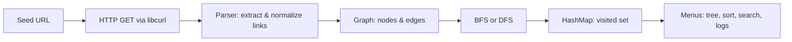

# WebCrawler

[](LICENSE)

**CS-221 — Data Structures & Algorithms (Semester 3)**  
An interactive **web crawler** and graph explorer built **from scratch** with **custom data structures** (queue, stack, hash map, merge sort on custom workflows, graph with BFS/DFS). It uses **libcurl** for HTTP fetch and a **terminal menu** for crawling, inspection, and logs.

---

## Table of contents

- [Overview](#overview)
- [Features](#features)
- [Repository layout](#repository-layout)
- [How it works](#how-it-works)
- [Build & run](#build--run)
- [Interactive menu](#interactive-menu)
- [Ethical crawling](#ethical-crawling)
- [Project timeline & team](#project-timeline--team)
- [License](#license)

---

## Overview

The program starts from a **seed URL**, downloads HTML, extracts links with a **parser**, and builds a **directed graph** of discovered pages. You can traverse the site with **BFS** (breadth-first) or **DFS** (depth-first), view a **spanning tree**, **sort** URLs with merge sort, **search** the visited set, and read **fetch logs**.

Custom **Queue** and **Stack** implementations (linked lists, no STL `queue`/`stack`) back BFS and DFS. A custom **HashMap** tracks visited URLs. The **Graph** module stores adjacency structure for the crawl frontier and results.

> **Note:** Some modules (for example the graph’s internal storage) may still use standard library types where appropriate for the course design; the core crawl ordering structures are custom as required by the project brief.

---

## Features

| Area | What you get |
|------|----------------|
| **Crawl** | BFS or DFS with configurable depth |
| **Graph** | Add nodes/edges, neighbors, URL ↔ index mapping |
| **Parser** | Extract `href` links, resolve relative URLs, filter invalid schemes |
| **Sorting** | Alphabetical URL list via merge sort |
| **Persistence** | HTTP fetch log under `logs/` |
| **UX** | Colored terminal UI on Windows (VT mode + UTF-8) |

---

## Repository layout

```text
Web-Crawler/
├── include/          # Public headers (.h)
├── src/              # Implementation (.cpp)
├── data/             # Reserved for crawl output / artifacts (.gitkeep)
├── logs/             # fetcher.log (created at runtime; log files gitignored)
├── LICENSE           # MIT
├── Makefile          # Build from repo root
└── README.md
```

---

## How it works

High-level pipeline:



<details>
<summary><strong>Module cheat-sheet</strong> (click to expand)</summary>

| Module | Role |
|--------|------|
| `main.cpp` | Interactive menu, crawl orchestration, spanning tree display, log viewer |
| `parser` | `parseHTML`, `resolveAndFilterLinks` |
| `Graph` | `addNode`, `addEdge`, `getNeighbors`, BFS/DFS helpers via crawl logic |
| `Queue` / `Stack` | FIFO / LIFO for BFS / DFS |
| `HashMap` | Visited URL set and lookup |
| `sorting` | Merge sort for URL lists |
| `filehandler` | `http_get`, fetch logging |

</details>

---

## Build & run

### Prerequisites

- **C++17** compiler (e.g. **g++** from [MSYS2](https://www.msys2.org/) UCRT64 on Windows)
- **libcurl** development package linked with `-lcurl`
- Run builds from the **repository root** so paths like `logs/fetcher.log` resolve correctly

### Build

**Option A — Makefile** (from MSYS2 UCRT64 / MinGW shell, or if `make` is on your `PATH`; on some Windows setups use `mingw32-make`):

```bash
make
```

Produces `webcrawler` (on Windows, `webcrawler.exe`).

**Option B — Manual g++** (adjust compiler path if needed):

```bash
g++ -std=c++17 -Wall -g -Iinclude -o webcrawler.exe ^
  src/main.cpp src/parser.cpp src/Graph.cpp src/filehandler.cpp ^
  src/sorting.cpp src/hashmaps.cpp src/dynamicarray.cpp src/queue.cpp src/stack.cpp ^
  -lcurl
```

> `src/mergesort.cpp` is a duplicate of the merge sort in `sorting.cpp` and is **not** linked in the default build to avoid duplicate symbols.

### Run

From the **repo root**:

```bash
./webcrawler.exe
```

On first run, `logs/` and `data/` are created automatically if missing.

---

## Interactive menu

After launch, use the numbered **MAIN MENU**:

| # | Action |
|---|--------|
| **1** | **Start crawling** — enter URL (`http://` or `https://`), max depth, choose **B**FS or **D**FS |
| **2** | **Spanning tree** of the last crawl (DFS-based tree view) |
| **3** | **List all** crawled URLs |
| **4** | **Sorted URLs** (merge sort) |
| **5** | **Search** for a URL in the visited set |
| **6** | **Log file** — view all or the last 20/50 lines of `logs/fetcher.log` |
| **7** | **Exit** |

Tips:

- Complete a crawl with **1** before options **2–5** that depend on graph data.
- Respect site owners: use small depth and allowed test domains (see below).

---

## Ethical crawling

- Use **reasonable depth limits** and avoid hammering production servers.
- Prefer **test or demo sites** you are allowed to crawl.
- Honor **robots.txt** and terms of service for real targets (this educational crawler is **not** a full compliance suite—use it responsibly).

---

## Project timeline & team

<details>
<summary><strong>Original week plan</strong></summary>

- **Week 1:** Queue, stack, graph skeleton, basic HTTP fetch  
- **Week 2:** Parser, BFS/DFS, graph + parser integration  
- **Week 3:** File handler, sorting, full pipeline, documentation  

</details>

**Contributors**

| Name | ID |
|------|-----|
| Labiba Ahmad | 2024260 |
| Maimoona Saboor | 2024270 |
| Qurat ulain | 2024526 |

*Project start: 22 November 2025*

---

## License

This project is released under the [MIT License](LICENSE).
